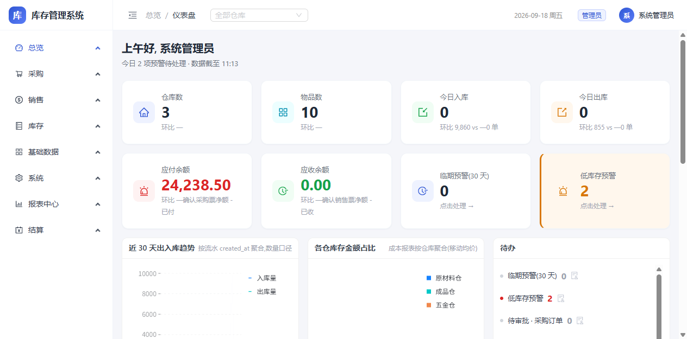
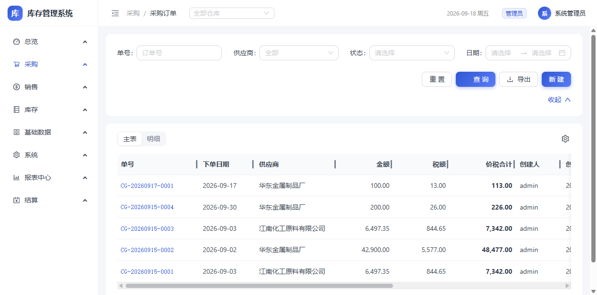
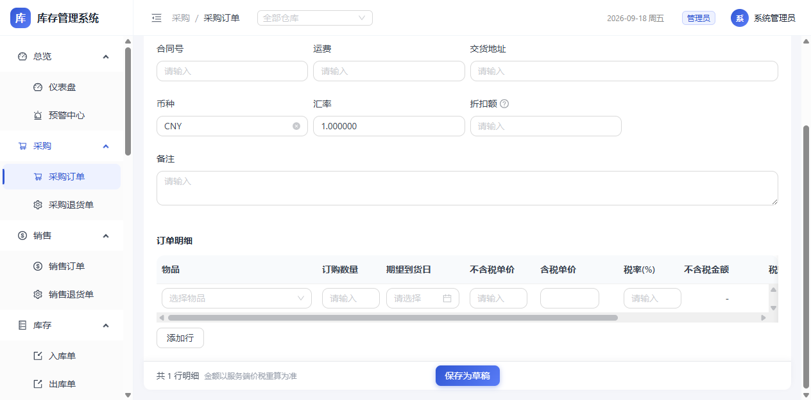
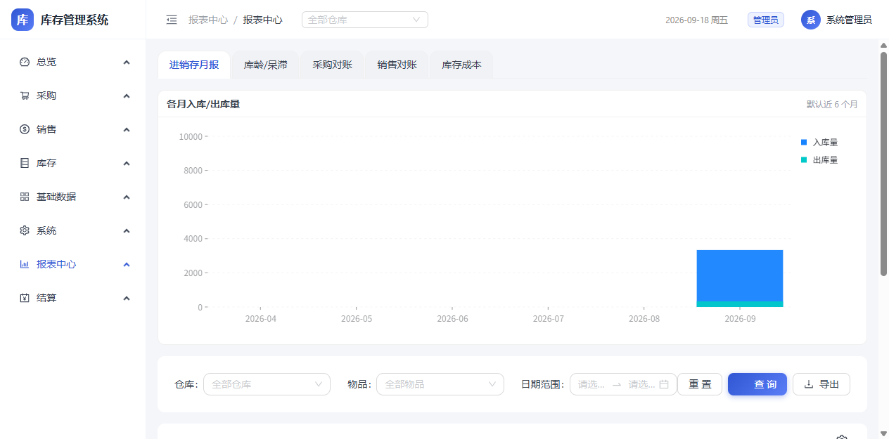
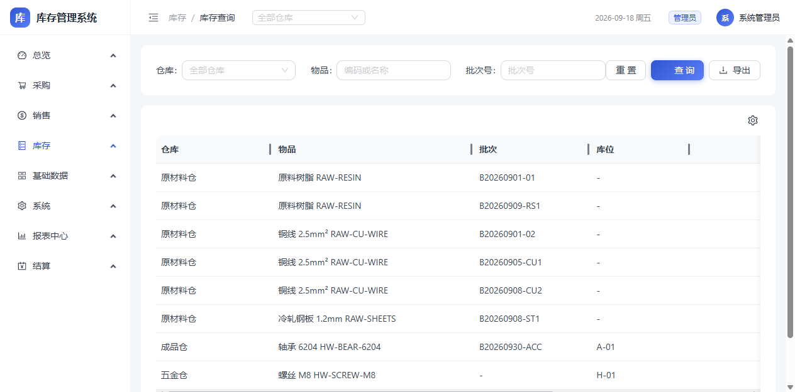

# 库存管理系统

> 前后端分离项目(Java 21 + Spring Boot 3.5 + MyBatis-Plus 3.5 + PostgreSQL 16 / Vite + React 18 + antd 5 + @ant-design/pro-components 2.8 列表页 ProTable、单据表单页 ProForm 表头)。
> 企业级进销存一期:采购/销售/调拨/盘点/调整/预警/审批/预占/退货/期初/报表 + 基础出入库 + 报价单/请购单(单据链)+ 站内消息 + 库存冻结/解冻 + 价目表,33 个 Controller,前端 45 个页面(27 个业务模块 + 登录)。
> 后端按阿里开发规范分层,出库条件 UPDATE 防穿仓、FEFO/FIFO 选批、序列号台账等核心规则零弱化。
> **291 条测试全绿**(114 存量 + 15 RBAC 批 1a + 2 RBAC 批 2 + 4 V9 通用字段补全 + 5 V10 对标字段补齐 + 8 V11 退货 + 6 V12 导入导出 + 5 V13 期初 + 4 V15 报表中心 + 3 V16 操作日志 + 6 V17 单据明细行 + 12 V18 三单匹配/结算域 + 1 V19 盘点防重复生成 + 1 V19b 序列号仓盘点调整 + 11 V20 库存成本移动均价报表 + 3 V20 数据权限按 id 补 403 + 6 V23 MoneyUtils 价税工具 + 2 V23 含税路径 + 1 超收比例口径校验 + 1 序列号退货回流 + 2 出入库列表关联单号按 refType 分表回填 + 10 企业级横切能力(幂等 3/防爆破 2/traceId 4/登出失效 1) + 7 Redis 状态持久化与权限缓存(RedisStateTest 4/AuthCacheTest 3) + 5 表格列偏好(TablePrefServiceTest 5) + 1 多角色自批回归(ApprovalPermissionTest) + 32 V25 单据链+站内消息(报价单 7/报价转订单 5/请购单 6/请购转订单 5/站内消息 6/审批消息钩子 3) + 1 跨类型调拨禁止回归 + 3 数据权限回归(销售订单/报价单/请购单按仓 403)+ 10 V26 库存冻结(StockFreezeTest)+ 10 V26 价目表(PriceListTest)),阿里 checkstyle 规则集(违规 0),前端 build 0 错。
> 时间统一东八区(Asia/Shanghai,JVM 显式锁定),格式 `yyyy-MM-dd HH:mm:ss`(日期 `yyyy-MM-dd`)。

## 界面预览

<table>
<tr>
<td></td>
</tr>
<tr>
<td align="center"><sub>仪表盘(总览)</sub></td>
</tr>
<tr>
<td></td>
</tr>
<tr>
<td align="center"><sub>采购订单列表(筛选 + 分页 + 详情弹窗)</sub></td>
</tr>
<tr>
<td></td>
</tr>
<tr>
<td align="center"><sub>新建采购订单(价税六列明细)</sub></td>
</tr>
<tr>
<td></td>
</tr>
<tr>
<td align="center"><sub>报表中心(进销存月报:图表 + 明细)</sub></td>
</tr>
<tr>
<td></td>
</tr>
<tr>
<td align="center"><sub>库存查询(多仓多物品余额)</sub></td>
</tr>
</table>

---

## 1. 架构

```
                   ┌──────────────────────┐
浏览器 (antd UI)   │  React SPA           │  端口 5173 (dev)
                   └─────────┬────────────┘
                             │ /api proxy (vite)
                             ▼
                   ┌──────────────────────┐
                   │  Spring Boot 后端    │  端口 8888
                   │  MyBatis-Plus / JWT  │  /api/v1/*
                   │  springdoc → /docs   │
                   └─────────┬────────────┘
                             │ JDBC
                             ▼
                   ┌──────────────────────┐
                   │  PostgreSQL 16       │  端口 5433 (docker)
                   └──────────────────────┘
```

后端分层:`controller → service(/impl) → mapper → model`(model 下 entity(DO)/dto/vo/query 四包,按功能再分文件夹,如 `model/dto/purchase/`)。
出入库/采购/销售/调拨在单个事务内完成(`StockCoreService`),出库扣减为条件 `UPDATE ... WHERE quantity >= qty`,affected rows=0 即"库存不足"整单回滚。

> 说明:PG 库表名/列名统一小写蛇形(`db/V6__snake_case.sql` 迁移),`map-underscore-to-camel-case: true`
> 自动映射 Java camelCase 字段 ↔ snake_case 列;手写 SQL 不写引号。审计四件套(creator/createdAt/updater/updatedAt)
> 由 `AuditMetaObjectHandler` 统一填充,DO 字段仅需 `@TableField(fill = ...)` 标记。

> **文档同步约定**:接口/权限变更时随代码一起更新 `docs/API一览.md`、`docs/权限矩阵.md` 与 README 对应章节;业务规则变更更新 `docs/核心业务规则.md`;测试数量变更更新 README 简介。每次实质变更同时追加一条到 `docs/迭代日志.md`(迭代流水账,含验证与遗留项)。

---

## 2. 启动步骤

```bash
# 1. 启动 PG + Redis(已起过可跳过;Redis 7.4 容器 inventory-redis,端口 6379,
#    存幂等/登出黑名单/登录锁定状态与权限缓存,重启不丢)
docker compose up -d

# 2. 推 schema + 种子数据(已推过可跳过)
docker exec -i inventory-postgres psql -U inv -d inventory < server-java/src/main/resources/db/schema.sql
docker exec -i inventory-postgres psql -U inv -d inventory < server-java/src/main/resources/db/seed.sql

# 3. 启动后端(IDEA 运行 InventoryApplication,或命令行)
cd server-java
bash ../scripts/mvn.sh spring-boot:run
# 后端:http://127.0.0.1:8888  Swagger:http://127.0.0.1:8888/docs

# 4. 启动前端
cd web
npm install   # 首次
npm run dev
# 前端:http://localhost:5173 (dev 代理 /api → 8888)

# 5. 测试 & 构建(在 server-java 下)
bash ../scripts/mvn.sh test        # 267 条,全绿,无 skip
bash ../scripts/mvn.sh package     # 0 错误
bash ../scripts/mvn.sh checkstyle:check   # 违规 0
```

> 本机 bash 下 `mvn` 直接跑有 classworlds 路径 bug,构建一律走 `scripts/mvn.sh` 包装脚本。
> 默认种子数据:3 仓库(原材料/成品/五金)+ 4 物品 + 库位 + 3 用户 + 字典 3 组(仓库类型/物品分类/结算方式)。

---

## 3. 三个默认账号

| 用户名 | 密码 | 角色 | 姓名 |
|---|---|---|---|
| `admin` | `admin123` | admin 管理员 | 系统管理员 |
| `zhangsan` | `zhang123` | operator 库员 | 张三 |
| `lisi` | `lisi123` | viewer 查看 | 李四 |

> **⚠️ 上线前必须修改 admin 密码**,可通过 `POST /api/v1/auth/password` 改密。

---

## 4. 角色权限矩阵

详见 [`docs/权限矩阵.md`](docs/权限矩阵.md)(22 接口组 × 3 角色,后端强制,前端只做菜单显隐;RBAC 多角色+数据权限口径)。

---

## 5. API 一览

前缀 `/api/v1`,列表统一 `{rows,total,page,pageSize}`。完整契约见 [`docs/API一览.md`](docs/API一览.md),线上以 Swagger 为准:`http://127.0.0.1:8888/docs`。

---

## 6. 核心业务规则

48 条(基础库存 + 进销存:审批流/退货/期初/报表/结算域/价税/单据链/站内消息/库存冻结/价目表等),完整内容见 [`docs/核心业务规则.md`](docs/核心业务规则.md)。要点速览:

- 出库扣减 = 条件 `UPDATE ... WHERE quantity >= qty`,0 行整单回滚,禁止先查后改(`StockCoreService`/`StockMapper.xml` 红线)
- 出库选批:保质期仓 FEFO、批次仓 FIFO,可手动指定;批次不存在入库自动创建
- 单据号 `RK/CK/CG/XS/DB/PD/TZ/CT/XT/QC-FP/FK/SK-YYYYMMDD-NNNN` 按天序列;时间统一东八区
- 采购到货可部分累计、到齐自动 completed、超收拒绝;销售审批即预占,防超卖
- 退货/期初 create 即过账(无草稿);盘点差异生成调整单,防重复三层防护
- 价税六列:金额=数量×不含税单价,服务端不含税优先、只填含税反算;GET 分页参数越界 400

## 7. 目录结构

```
inventory-system/
├── AGENTS.md                  AI 编码代理工作手册(代理原生读取)
├── docker-compose.yml         PG 16-alpine(5433)+ Redis 7.4(6379)
├── .github/workflows/ci.yml   CI 双 job 并行:backend(PG16+Redis7.4 服务容器,测试+checkstyle+打包)/ frontend(npm ci+build)
├── scripts/mvn.sh             Maven 包装脚本(本机 bash 路径兼容)
├── docs/                      项目文档
│   ├── 迭代日志.md            迭代流水账(每次实质变更追加一条)
│   ├── 权限矩阵.md            角色权限矩阵(接口组 × 角色,RBAC+数据权限口径)
│   ├── API一览.md             全部接口契约(前缀 /api/v1)
│   └── 核心业务规则.md        43 条核心业务规则(基础库存 + 进销存)
├── server-java/               Spring Boot 后端(阿里规范)
│   ├── pom.xml                Boot 3.5.x / MyBatis-Plus 3.5.x / jjwt / springdoc / EasyExcel 3.3.4(V12) / Lombok / checkstyle
│   ├── checkstyle.xml         阿里规范规则集(中文 Javadoc 适配)
│   ├── src/main/java/com/company/inventory/
│   │   ├── InventoryApplication.java  入口(@MapperScan mapper 包;JVM 时区锁 Asia/Shanghai)
│   │   ├── common/            错误码 / BizException / 全局异常 / 分页 / ApprovalGuard
│   │   ├── config/            MybatisPlus / Jwt / @RequirePerm 权限码注解 / Swagger / Jackson(东八区+格式)
│   │   ├── controller/        33 个 Controller
│   │   ├── model/             数据层:entity(DO)/dto/vo/query 四包,按功能再分包
│   │   ├── mapper/            53 个 Mapper + resources/mapper/*.xml
│   │   ├── service/ (+impl/)  业务层;StockCoreService = 库存核心
│   │   └── support/           DictReferenceRegistry(字典引用校验注册表)
│   ├── src/main/resources/
│   │   ├── application.yml    8888 / 5433 / JWT / jackson(Asia/Shanghai)
│   │   └── db/{schema,seed}.sql(初始化)+ V2~V26__*.sql(历史迁移归档)
│   └── src/test/java/         45 个测试类,291 条(库存核心/并发/采购/销售/调拨/盘点/调整编辑/权限/字典/预警/仓库库位编辑/审计字段/日期解析/系统监控/RBAC 批 1a/RBAC 批 2 多角色+数据权限/V9 通用字段补全/V10 对标字段补齐/V11 退货/V12 导入导出/V13 期初/V15 报表中心/V16 操作日志/V17 单据明细行/V18 三单匹配+结算域/V19 盘点防重复生成/V19b 序列号仓盘点调整/V20 库存成本报表/V23 价税工具+含税路径/V24 出入库关联单号分表回填/企业级横切能力:幂等+防爆破+traceId+登出失效/Redis 状态持久化+权限缓存/表格列偏好/多角色自批回归/V25 单据链:报价单+请购单+转换+站内消息/跨类型调拨禁止+数据权限回归/V26 库存冻结+价目表)
└── web/                       Vite + React 18 + antd 5
    └── src/
        ├── api/  auth/  components/  layout/
        ├── pages/             45 个页面(27 个业务模块 + 登录):login / dashboard / inbound(list+form) /
        │                      outbound(list+form) / stock / transaction / item(list+form) /
        │                      warehouse / location / user / role / menu / purchase(list+new) /
        │                      sales(list+new) / purchase-return(list+new) / sales-return(list+new) /
        │                      transfer / stocktake / adjust / alert /
        │                      supplier / customer / dict / monitor / operation-log(V16) /
        │                      sales-quotations(list+new) / purchase-requisitions(list+new) /
        │                      price(V26 价目表)
        ├── main.tsx           入口:dayjs.locale("zh-cn")(日历中文)
        └── styles/  theme.ts  浅色底 + 深蓝主色
```

---

## 8. 生产部署(单机 Docker Compose)

目标机形态:一台 Linux 服务器 + 已有公共服务栈(nginx/mysql/redis 等,网络名以目标机为准,下文以 `host-app-net` 示意)。

**架构:基础设施全复用,应用栈单容器**
- 公共服务栈新增 `postgres` 服务(16-alpine,数据目录按目标机约定,仅 `127.0.0.1:5433`)。老内核 Docker 默认 seccomp 会拦 PG16 initdb 的系统调用,该服务须加 `security_opt: seccomp=unconfined`。
- 应用栈 `deploy/inventory-stack.yml` 只有 `inventory-app`(temurin 21 + jar),PG/Redis 走同网络容器名直连。
- 前端挂 80 端口 `/inventory` 子路径(同 IP 多项目按路径共享 80,不再单独开端口):nginx location 组(assets 长缓存 / `/inventory/api/` 剥前缀反代 / SPA 回退)并入既有 80 server 块,模板见 `deploy/nginx/inventory-80.conf`。
- 部署产物双路径:CI `upload-artifact`(jar + dist)/ 本地 `mvn package` + `npm run build` 后 SFTP 直传,落 `/opt/inventory/app/server.jar`(路径按目标机调整)。

**配置(按环境拆三份)**
- `application.yml` 公共段;`application-dev.yml` 本地(PG 5433 / 无密码 Redis);`application-prod.yml` 生产——全部连接项走环境变量,**缺失即启动失败(fail-fast,不静默连错库)**。
- 敏感值(`DB_PASSWORD` / `REDIS_PASSWORD` / `JWT_SECRET`)只存在服务器 `/opt/inventory/.env`(600),compose 自动读取注入;仓库内文件零密码。

**部署步骤(摘要)**
```bash
# 1. 公共服务栈起 postgres(见上)
# 2. 上传 jar + dist 到 /opt/inventory/app/ 与站点目录
# 3. 写 /opt/inventory/.env(三个键),chmod 600
# 4. 首次导入 schema/seed:docker exec -i postgres psql -U inv -d inventory < schema.sql(再 seed.sql)
# 5. docker compose -f inventory-stack.yml up -d   # healthcheck 通过即完
```

**安全基线**:数据库/Redis 端口只绑 127.0.0.1,对外仅 22/80/443;后端 8888 不对外,一律经 nginx 反代。
**注意**:生产是 `http://IP` 非安全上下文,`crypto.randomUUID` 不可用——前端幂等键已做 `getRandomValues` 兜底,新增用到该 API 的代码必须保留兜底。

---

## 9. 常见问题

**Q: 出库报"库存不足"?**
A: 该仓库/物品/批次下余额不足,或序列号已 `out`,或销售预占占用了可用量。可用 `/api/v1/stock` 查询余额与预占。

**Q: 销售审批被驳回"仍缺 N"?**
A: 审批时做预占可行性校验,可用量(库存 - 预占)不够即驳回,防超卖。

**Q: 日期选择器/日历显示英文?**
A: 日历文案来自 dayjs 全局 locale,`main.tsx` 已显式 `dayjs.locale("zh-cn")`;新增页面无需再配。

**Q: 时间显示成 UTC 或 ISO 裸格式?**
A: 后端 `InventoryApplication.main()` 已锁 JVM 时区 + Jackson `Asia/Shanghai` + `yyyy-MM-dd HH:mm:ss`,新接口沿用即可。

**Q: PG 表名大小写报错 "relation does not exist"?**
A: 表/列统一小写蛇形(V6 迁移后),手写 SQL 不写引号;DO 走 `map-underscore-to-camel-case` 自动映射,新增 DO/XML 照抄 `StockMapper.xml` 的写法即可。

**Q: MyBatis-Plus 空集合 `IN ( )` 报 500?**
A: `selectByIds`/`IN` 前必须 `isEmpty` 防护(本项目 6 处已有)。

**Q: 端口?**
A: PG 5433(避开本机 5432);后端 8888;前端 dev 5173。 后端端口 2026-09-14 从 8081 迁至 8888(8081 另有用途)。
